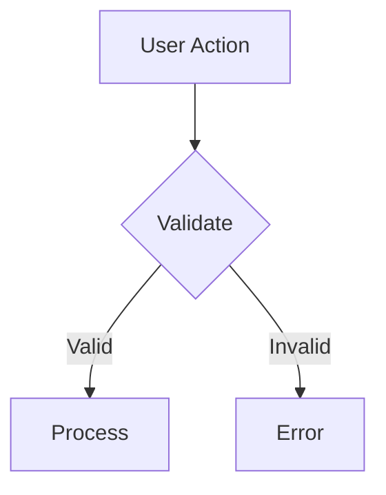

# Documentation Structure & Conventions

> Guidelines for writing and organizing Mangala Wallet documentation.

## Directory Structure

```
docs/
├── _meta/                        # Meta documentation (internal use)
│   ├── project-context.md        # Current state, progress tracking
│   ├── docs-structure.md         # This file
│   └── templates/                # Document templates
│
├── getting-started/              # Tier 1: Onboarding
│   ├── introduction.md           # What is Mangala Wallet?
│   ├── quick-start.md            # 5-minute setup
│   ├── installation.md           # Detailed setup
│   └── first-contribution.md     # Contributing guide
│
├── architecture/                 # Tier 2: Technical Deep-dive
│   ├── overview.md               # High-level architecture
│   ├── module-structure.md       # Module organization
│   ├── data-flow.md              # Data patterns
│   ├── build-variants.md         # Cold/UI/Pro variants
│   ├── security-model.md         # Security architecture
│   └── diagrams/                 # Visual diagrams
│       ├── module-dependencies.mmd
│       ├── data-flow.mmd
│       └── wallet-creation.mmd
│
├── features/                     # Feature Documentation
│   ├── wallet-management.md      # Wallet CRUD, import/export
│   ├── transaction-flow.md       # Send/receive flow
│   ├── authentication.md         # PIN, biometric, passkey
│   ├── security.md               # Security features
│   └── chain-integrations/       # Chain-specific docs
│       ├── antelope.md
│       ├── evm.md
│       └── bitcoin.md
│
├── development/                  # Developer Guides
│   ├── coding-standards.md       # Code conventions
│   ├── testing-guide.md          # Testing strategies
│   ├── debugging.md              # Debug techniques
│   ├── common-issues.md          # FAQ & troubleshooting
│   └── tools/                    # Development tools
│       ├── gradle-tasks.md
│       └── ci-cd.md
│
├── api-reference/                # API Documentation
│   ├── core-modules.md           # Core module APIs
│   ├── data-layer.md             # Repository APIs
│   └── domain-layer.md           # Use case APIs
│
└── releases/                     # Release Management
    ├── changelog.md              # Version history
    └── migration-guides/         # Breaking changes
        └── v1-to-v2.md
```

## Naming Conventions

### Files
- Use **kebab-case**: `wallet-management.md`, `quick-start.md`
- Be descriptive but concise
- Avoid abbreviations unless universally known (e.g., `api`, `ui`)

### Directories
- Use **kebab-case**: `getting-started/`, `chain-integrations/`
- Singular names for concepts: `feature/` not `features/` (exception: `releases/`)

### Anchors & Links
- Use relative paths: `../architecture/overview.md`
- Include `.md` extension in links
- Use descriptive anchor text: `[See Architecture Overview](../architecture/overview.md)`

## Document Structure

### Standard Sections

Every document should have:

```markdown
# Title

> One-line description (appears in search/preview)

## Overview
Brief introduction - what, why, when to use.

## [Main Content Sections]
...

## See Also
- Related links
- Next steps
```

### Headings
- **H1 (#)**: Document title only, once per document
- **H2 (##)**: Main sections
- **H3 (###)**: Subsections
- **H4 (####)**: Only if necessary, prefer restructuring

### Code Blocks

Always specify language:

```kotlin
// Kotlin code
val wallet = WalletManager.create()
```

```bash
# Shell commands
./gradlew build
```

```mermaid
# Diagrams
flowchart LR
    A --> B
```

### Tables

Use for structured data:

| Column 1 | Column 2 | Column 3 |
|----------|----------|----------|
| Data | Data | Data |

### Callouts

Use blockquotes with emoji for emphasis:

> **Note**: Important information

> **Warning**: Potential issues

> **Tip**: Helpful suggestions

## Writing Style

### Voice & Tone
- **Active voice**: "Create a wallet" not "A wallet is created"
- **Present tense**: "This function returns" not "This function will return"
- **Second person**: "You can configure" not "Users can configure"
- **Direct**: Be concise, avoid filler words

### Technical Writing
- Define acronyms on first use: "Kotlin Multiplatform (KMP)"
- Link to external resources for complex topics
- Include working code examples from the actual codebase
- Specify file paths: `core/wallet/src/commonMain/kotlin/...`

### Formatting
- Line length: Soft wrap at ~100 characters for readability
- Lists: Use `-` for unordered, numbers for ordered/sequential
- Emphasis: **Bold** for UI elements, `code` for technical terms

## Diagrams

### Mermaid (Preferred)
Use Mermaid for diagrams - renders in GitHub/GitLab:



### Diagram Types
- **Flowcharts**: User flows, decision trees
- **Sequence diagrams**: API calls, component interactions
- **Class diagrams**: Module structure (simplified)
- **ER diagrams**: Data models

### Diagram Files
Store complex diagrams in `docs/architecture/diagrams/`:
- `*.mmd` files for Mermaid source
- Can include in docs with: `!include diagrams/flow.mmd`

## Versioning

### Document Versions
- No version numbers in filenames
- Use git history for versioning
- Migration guides for breaking changes: `releases/migration-guides/`

### Changelog
Maintain `docs/releases/changelog.md`:

```markdown
## [1.2.0] - 2025-02-01

### Added
- New feature X

### Changed
- Updated behavior Y

### Fixed
- Bug Z
```

## Quality Checklist

Before publishing a document:

- [ ] **Accurate**: Verified against current code
- [ ] **Complete**: Covers common use cases
- [ ] **Clear**: New developer can understand
- [ ] **Consistent**: Matches project style
- [ ] **Linked**: References related docs
- [ ] **Tested**: Code examples work
- [ ] **Reviewed**: Spell-checked, grammar OK

## Maintenance

### When to Update Docs
- New feature added
- API changed
- Bug fixed that affects usage
- User feedback indicates confusion

### Doc Review Process
1. Update doc in feature branch
2. Include in PR with code changes
3. Review alongside code review
4. Merge together

### Stale Doc Detection
Run `/docs-writer sync` to identify:
- Docs referencing deleted files
- Docs with outdated code examples
- Missing docs for new features

---

**Principle**: Documentation should be treated as code - reviewed, tested, and maintained with the same rigor.
