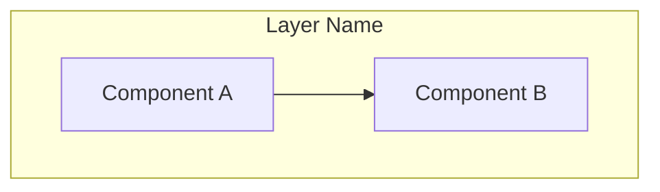
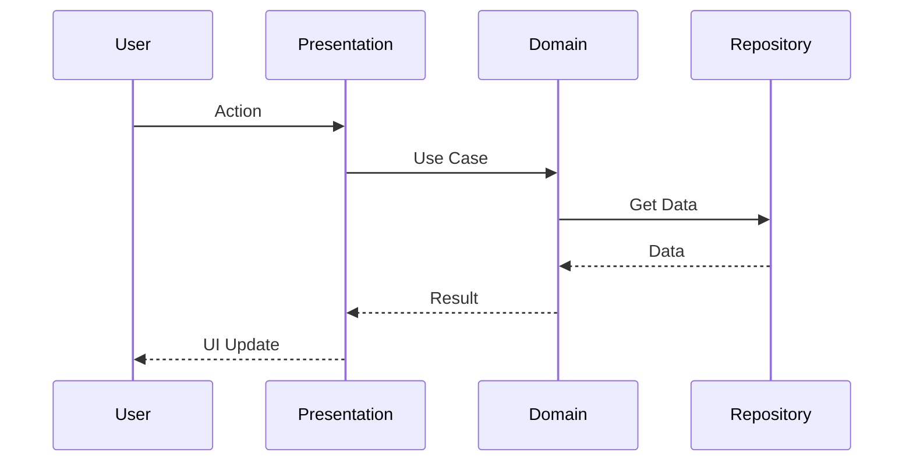

# [Component/System Name]

> [One-line description of what this component does]

## Overview

[2-3 paragraphs explaining:
- What this component/system does
- Why it exists (problem it solves)
- Where it fits in the overall architecture]

## Architecture Diagram



## Key Concepts

### [Concept 1]

[Explanation of the concept]

**Example**:
```kotlin
// Code illustrating the concept
```

### [Concept 2]

[Explanation of the concept]

## Components

### [Component Name]

**Purpose**: [What it does]

**Location**: `path/to/component/`

**Key classes**:
- `ClassName` - [Description]
- `AnotherClass` - [Description]

**Dependencies**:
- Depends on: [List dependencies]
- Used by: [List consumers]

### [Another Component]

[Same structure as above]

## Data Flow



### Flow Description

1. **Step 1**: [Description]
2. **Step 2**: [Description]
3. **Step 3**: [Description]

## Implementation Details

### [Detail 1]

[Technical explanation]

**Code reference**: `path/to/file.kt:123`

```kotlin
// Relevant code snippet
```

### [Detail 2]

[Technical explanation]

## Configuration

| Setting | Description | Default | Location |
|---------|-------------|---------|----------|
| `setting1` | What it does | `value` | `path/to/config` |
| `setting2` | What it does | `value` | `path/to/config` |

## Integration Points

### With [System A]

[How this component integrates with System A]

### With [System B]

[How this component integrates with System B]

## Design Decisions

### Why [Decision 1]?

**Context**: [What problem were we solving]

**Decision**: [What we decided]

**Rationale**: [Why this approach]

**Trade-offs**: [What we gave up]

### Why [Decision 2]?

[Same structure]

## Known Limitations

- Limitation 1: [Description and workaround if any]
- Limitation 2: [Description and workaround if any]

## Future Considerations

- [ ] Potential improvement 1
- [ ] Potential improvement 2

## See Also

- [Related Doc 1](../path/to/doc.md) - [Brief description]
- [Related Doc 2](../path/to/doc.md) - [Brief description]
- [External Resource](https://link) - [Brief description]
