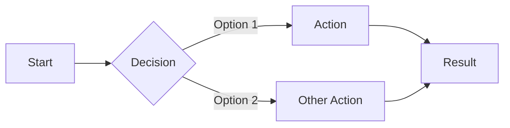
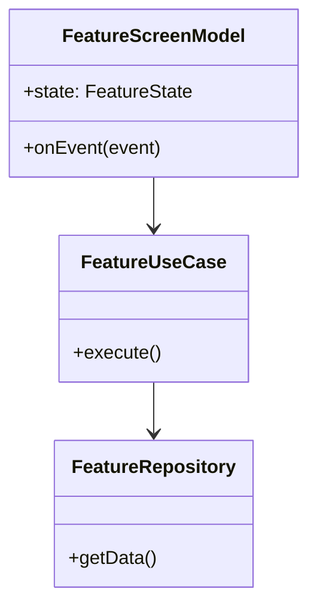

# [Feature Name]

> [One-line description of what users can do with this feature]

## Overview

[Brief description of the feature from user perspective - what problem it solves, when to use it]

## User Stories

- As a user, I can [action] so that [benefit]
- As a user, I want [desire] so that [benefit]
- As a user, I need [requirement] to [goal]

## How It Works

### User Flow



### Architecture



### Key Components

| Component | Location | Responsibility |
|-----------|----------|----------------|
| `FeatureScreen` | `features/feature/ui/` | UI rendering |
| `FeatureScreenModel` | `features/feature/ui/` | State management |
| `FeatureUseCase` | `domain/feature/` | Business logic |
| `FeatureRepository` | `data/feature/` | Data access |

## Usage

### Basic Example

```kotlin
// How to use this feature programmatically
val result = featureUseCase.execute(params)
```

### With Configuration

```kotlin
// Example with configuration options
val config = FeatureConfig(
    option1 = true,
    option2 = "value"
)
val result = featureUseCase.execute(params, config)
```

## States

### UI States

```kotlin
sealed interface FeatureState {
    data object Loading : FeatureState
    data class Content(val data: Data) : FeatureState
    data class Error(val message: String) : FeatureState
}
```

### State Transitions

| Current State | Event | Next State |
|---------------|-------|------------|
| Loading | DataLoaded | Content |
| Loading | ErrorOccurred | Error |
| Error | Retry | Loading |

## Configuration

| Option | Type | Default | Description |
|--------|------|---------|-------------|
| `option1` | Boolean | `true` | What it controls |
| `option2` | String | `"default"` | What it controls |

## Error Handling

### Common Errors

| Error | Cause | User Message | Recovery |
|-------|-------|--------------|----------|
| `NetworkError` | No connection | "Check your internet" | Retry button |
| `ValidationError` | Invalid input | "Please check your input" | Fix and retry |

### Error Handling Code

```kotlin
when (result) {
    is Result.Success -> handleSuccess(result.data)
    is Result.Error -> when (result.error) {
        is NetworkError -> showRetryDialog()
        is ValidationError -> showValidationError(result.error.message)
    }
}
```

## Testing

### Unit Tests

Location: `features/feature/src/commonTest/`

```kotlin
@Test
fun `feature should do X when Y`() {
    // Arrange
    val useCase = FeatureUseCase(mockRepository)

    // Act
    val result = useCase.execute(testParams)

    // Assert
    assertEquals(expected, result)
}
```

### UI Tests

Location: `features/feature/src/androidTest/`

```kotlin
@Test
fun featureScreen_displaysCorrectly() {
    // Test UI rendering
}
```

## Platform Differences

### Android

[Any Android-specific behavior or implementation]

### iOS

[Any iOS-specific behavior or implementation]

## Security Considerations

- [Security consideration 1]
- [Security consideration 2]

## Performance

- [Performance characteristic 1]
- [Optimization applied]

## Related Features

- [Related Feature 1](./related-feature.md) - How they interact
- [Related Feature 2](./another-feature.md) - Dependencies

## Changelog

| Version | Changes |
|---------|---------|
| 1.2.0 | Added X capability |
| 1.1.0 | Fixed Y issue |
| 1.0.0 | Initial release |

## See Also

- [API Reference](../api-reference/feature-api.md)
- [Architecture Overview](../architecture/overview.md)
- [Related External Doc](https://link)
