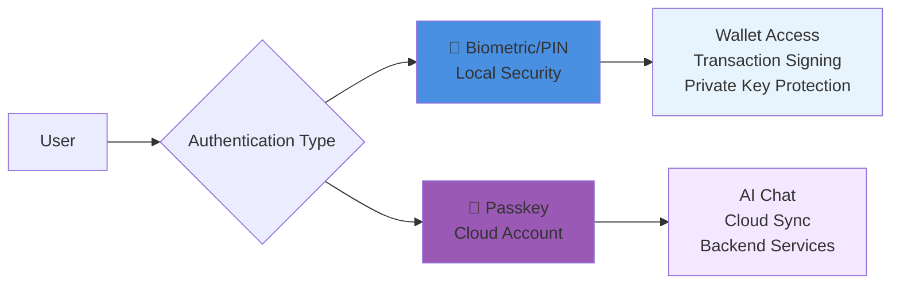
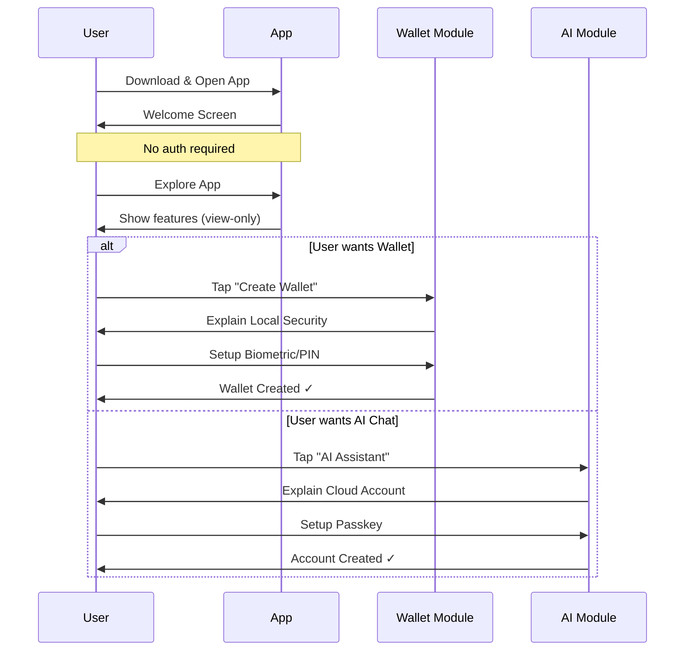
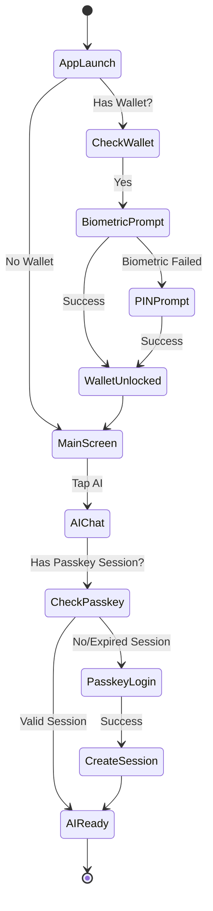
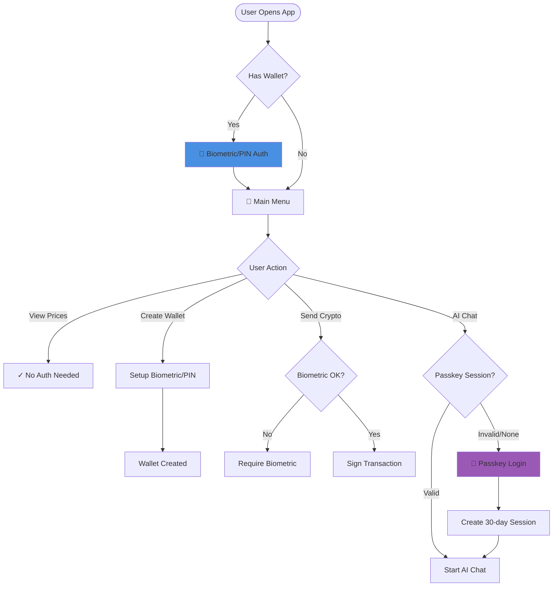
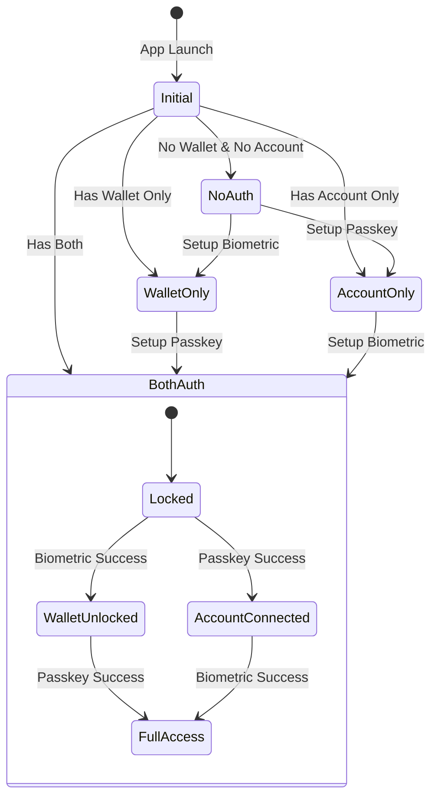
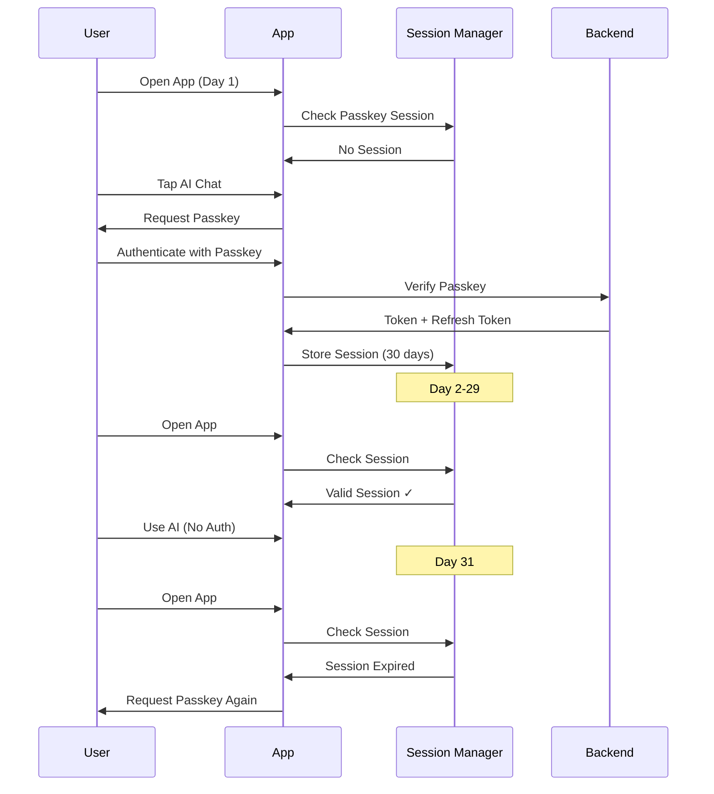
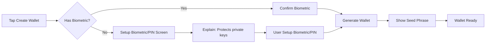
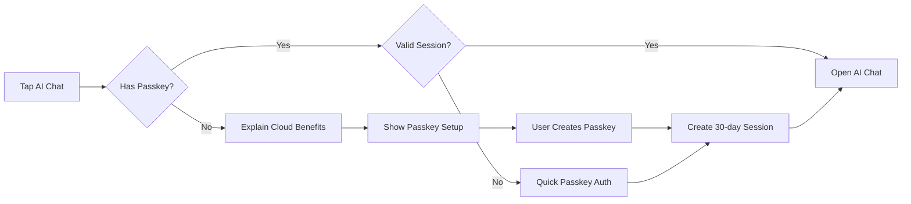
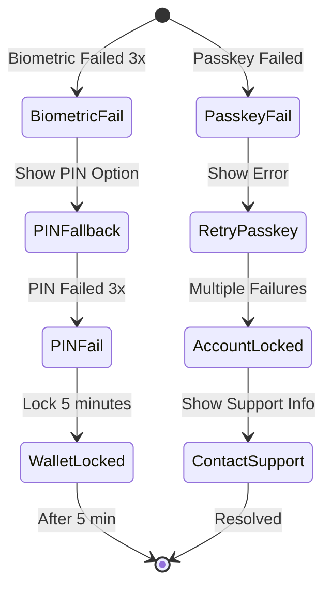

# Crypto Wallet with Dual Authentication System - Complete Documentation

## 1. Overview

### 1.1 Two Authentication Systems



### 1.2 Core Principles

1. **Biometric/PIN**: Protects private keys stored locally on device
2. **Passkey**: Authentication with backend services (AI, sync, backup)
3. **Session Management**: Reduce friction with smart session handling
4. **Progressive Security**: Only require auth when truly necessary

## 2. User Journey Flows

### 2.1 New User Onboarding Flow



### 2.2 Returning User - Daily Usage Flow



### 2.3 Complete Feature Access Flow



## 3. Authentication State Management

### 3.1 State Diagram



### 3.2 Session Management Flow



## 4. UI/UX Implementation Details

### 4.1 Visual Security Indicators

```
┌─────────────────────────────────────┐
│  Status Bar                         │
│  ┌──────────────┬─────────────────┐ │
│  │ 🔐 Wallet: Open │ ☁️ Cloud: OK │ │
│  └──────────────┴─────────────────┘ │
└─────────────────────────────────────┘

States:
- 🔒 Wallet: Locked    | ☁️ Cloud: Offline
- 🔓 Wallet: Open      | ☁️ Cloud: Connected
- 🚫 Wallet: Not Set   | ☁️ Cloud: Not Connected

```

### 4.2 Authentication Screens

### Biometric/PIN Screen (Wallet)

```
┌─────────────────────────┐
│    💰 Unlock Your Wallet│
│                         │
│    ╭─────────────╮      │
│    │ Fingerprint │      │
│    │    Icon     │      │
│    ╰─────────────╯      │
│                         │
│  Touch to unlock wallet │
│                         │
│  ────────────────────   │
│                         │
│  [Use PIN Instead]      │
└─────────────────────────┘

```

### Passkey Screen (Cloud Account)

```
┌─────────────────────────┐
│    ☁️ Connect to Cloud  │
│                         │
│    ╭─────────────╮      │
│    │   Passkey   │      │
│    │    Icon     │      │
│    ╰─────────────╯      │
│                         │
│  Sign in to:            │
│  • Chat with AI         │
│  • Save chat history    │
│  • Sync across devices  │
│                         │
│  [🔑 Sign In]           │
│  [Skip for Now]         │
└─────────────────────────┘

```

### 4.3 Feature-Specific Flows

### A. Creating First Wallet



### B. First AI Chat Access



## 5. Error States & Edge Cases

### 5.1 Authentication Failure Handling



### 5.2 Edge Case Flows

```
1. Lost Device with Wallet
   └── Need: Seed phrase recovery
   └── Biometric/PIN = Lost
   └── Must: Import seed → Setup new Biometric

2. Passkey Device Changed
   └── Need: Login on new device
   └── Session = Invalid
   └── Must: Passkey auth → New session

3. Biometric Changed (new fingerprint)
   └── Fallback: PIN still works
   └── Re-enroll biometric

4. Both Auth Methods Forgotten
   └── Wallet: Need seed phrase
   └── Account: Need passkey recovery

```

## 6. Implementation Guidelines

### 6.1 State Management Structure

```tsx
interface AppAuthState {
  wallet: {
    hasWallet: boolean;
    isUnlocked: boolean;
    lastUnlock: Date;
    biometricEnabled: boolean;
    pinEnabled: boolean;
  };

  cloudAccount: {
    hasAccount: boolean;
    passkeyEnabled: boolean;
    session: {
      token: string;
      refreshToken: string;
      expiresAt: Date;
      deviceId: string;
    } | null;
  };

  ui: {
    showingAuth: 'biometric' | 'passkey' | null;
    lastAction: string;
    pendingAction: string | null;
  };
}

```

### 6.2 Smart Routing Logic

```tsx
function requiresAuth(action: UserAction): AuthType | null {
  switch(action.type) {
    // Wallet actions need Biometric
    case 'VIEW_BALANCE':
    case 'SEND_CRYPTO':
    case 'VIEW_PRIVATE_KEY':
      return state.wallet.isUnlocked ? null : 'biometric';

    // AI actions need Passkey session
    case 'CHAT_AI':
    case 'VIEW_CHAT_HISTORY':
      return isValidSession() ? null : 'passkey';

    // No auth needed
    case 'VIEW_PRICES':
    case 'READ_NEWS':
      return null;
  }
}

```

### 6.3 Session Management Best Practices

```tsx
class PasskeySessionManager {
  // Constants
  SESSION_DURATION = 30 * 24 * 60 * 60 * 1000; // 30 days
  REFRESH_THRESHOLD = 7 * 24 * 60 * 60 * 1000; // 7 days

  async validateSession(): Promise<boolean> {
    const session = await getStoredSession();

    if (!session) return false;

    // Check expiry
    if (Date.now() > session.expiresAt) {
      await this.clearSession();
      return false;
    }

    // Auto-refresh if close to expiry
    if (Date.now() > session.expiresAt - this.REFRESH_THRESHOLD) {
      await this.refreshSession();
    }

    return true;
  }
}

```

## 7. Messaging & Copy Guidelines

### 7.1 User-Facing Copy

```
DON'T: "You need 2 authentication systems"
DO: "Secure wallet + Cloud connection"

DON'T: "Passkey is required for AI"
DO: "Sign in to save chat history"

DON'T: "Re-authenticate to continue"
DO: "Confirm identity to send funds"

```

### 7.2 Educational Tooltips

```
First Wallet Creation:
"🔐 Fingerprint/PIN protects your funds on this device"

First AI Access:
"☁️ Cloud account enables AI chat and sync across devices"

Transaction Signing:
"✍️ Confirm with fingerprint to securely sign transaction"

```

## 8. Metrics & Success Tracking

### 8.1 Key Metrics to Monitor

```
1. Onboarding Funnel:
   - App Install → First Action: ??%
   - First Action → Biometric Setup: ??%
   - First Action → Passkey Setup: ??%
   - Both Auth Setup: ??%

2. Daily Usage:
   - Avg Biometric prompts/day: <?
   - Avg Passkey prompts/month: <?
   - Session timeout → Re-auth: ??%

3. Error Rates:
   - Biometric failure rate: <?%
   - Passkey failure rate: <?%
   - Support tickets about auth: <?%

```

### 8.2 A/B Testing Recommendations

```
Test 1: Onboarding Order
A: Wallet-first (Biometric → Passkey)
B: Choice-first (User selects path)

Test 2: Session Duration
A: 30 days
B: 90 days

Test 3: Messaging
A: Technical (Biometric/Passkey)
B: Benefit-focused (Quick access/Cloud sync)

```

## 9. Summary & Next Steps

### Key Decisions Made:

1. ✅ Dual auth system is necessary and follows banking patterns
2. ✅ Session management reduces friction
3. ✅ Progressive disclosure prevents overwhelm
4. ✅ Clear visual separation helps understanding

### Implementation Priority:

1. **Phase 1**: Core auth flows with clear messaging
2. **Phase 2**: Session management optimization
3. **Phase 3**: Advanced features (backup, recovery)

### Success Criteria:

- <5% users confused about dual auth (via support tickets)
- 80% users complete both auth setups within 7 days
- <3 passkey prompts per month per user
- 4.0 app store rating maintained