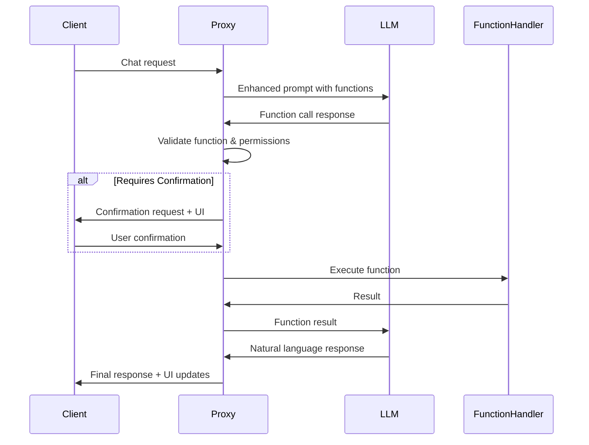

# Core AI Backend Proxy Technical Specification

## Executive Summary

This document outlines the technical specification for implementing a backend proxy service to handle LLM (Large Language Model) interactions for the Mangala Wallet application. The proxy will secure API keys on the server-side and provide enhanced control over UI component rendering in the client application.

## Table of Contents

1. [Current Architecture Overview](#current-architecture-overview)
2. [Proposed Backend Proxy Architecture](#proposed-backend-proxy-architecture)
3. [API Specifications](#api-specifications)
4. [Security Architecture](#security-architecture)
5. [UI Component Control System](#ui-component-control-system)
6. [Function Calling Implementation](#function-calling-implementation)
7. [WebSocket Support](#websocket-support)
8. [Migration Strategy](#migration-strategy)
9. [Implementation Guidelines](#implementation-guidelines)
10. [Performance Considerations](#performance-considerations)

## Current Architecture Overview

### Client-Side LLM Integration
The current implementation embeds LLM API keys directly in the client application through build-time configuration:

- **Multiple Provider Support**: Gemini, OpenAI, Anthropic, Ollama, and Mangala
- **Build-Time Key Injection**: API keys stored in `local.properties` and embedded via BuildKonfig
- **Direct API Calls**: Client directly communicates with LLM providers
- **Function Registry**: Local function definitions and handlers

### Key Components
```kotlin
// Current flow
Client App → AI Service → LLM Provider API
           ↓
    Function Registry
           ↓
    UI Components
```

### Identified Issues
1. API keys exposed in client binary
2. No runtime control over function availability
3. Limited UI customization from backend
4. No usage tracking or rate limiting
5. Difficult to update AI behavior without app updates

## Proposed Backend Proxy Architecture

### High-Level Architecture
```
┌─────────────────┐     ┌─────────────────┐     ┌─────────────────┐
│   Client App    │────▶│  Backend Proxy  │────▶│  LLM Providers  │
└─────────────────┘     └─────────────────┘     └─────────────────┘
        │                        │                         │
        │                        ├── API Key Management   │
        │                        ├── Rate Limiting        │
        │                        ├── Usage Tracking       │
        │                        ├── Function Registry    │
        │                        └── UI Control Logic     │
        │                                                  │
        └──────── WebSocket (streaming) ───────────────────┘
```

### Core Components

#### 1. API Gateway
- Handle authentication and authorization
- Rate limiting per user/device
- Request/response logging
- Error handling and retry logic

#### 2. LLM Service Manager
- Provider abstraction layer
- API key rotation and management
- Load balancing across providers
- Fallback mechanisms

#### 3. Function Registry Service
- Dynamic function registration
- Permission-based function access
- Function versioning
- Runtime configuration updates

#### 4. UI Control Service
- Dynamic UI component definitions
- Component versioning
- A/B testing support
- Platform-specific variations

## Security Architecture

### Authentication & Authorization
1. **User Authentication**
   - JWT-based authentication
   - Device fingerprinting
   - Multi-factor authentication support

2. **API Key Management**
   - Encrypted storage (e.g., HashiCorp Vault)
   - Key rotation schedule
   - Provider-specific rate limiting
   - Audit logging

3. **Function Security Levels**
   ```typescript
   enum SecurityLevel {
     LOW = "low",           // Informational functions
     MEDIUM = "medium",     // Read operations
     HIGH = "high"          // Write/transaction operations
   }
   ```

4. **Confirmation Flow**
   - Generate confirmation tokens for high-security functions
   - Time-limited tokens (e.g., 5 minutes)
   - One-time use enforcement
   - Cryptographic signing of confirmation data

### Data Protection
1. **In-Transit Security**
   - TLS 1.3+ for all communications
   - Certificate pinning on mobile clients
   - Perfect forward secrecy

2. **At-Rest Security**
   - Encryption of sensitive data
   - PII anonymization
   - Conversation history retention policies

## System Prompt Management

### Current Implementation
The system prompt is currently hardcoded in the client application within `SendMessageUseCase.kt`. This prompt defines the AI assistant's behavior for managing cryptocurrency wallet contacts.

#### Current System Prompt Structure
```kotlin
val systemPrompt = """
    You are a chatbot for a cryptocurrency wallet app. Your role is to assist users in managing their contacts by creating, editing, and deleting contacts.
    
    CREATE CONTACT FLOW:
    [Contact creation instructions...]
    
    When you are asking the user to select the blockchain network, and that is the only thing you are asking for in that message, include the tag [SELECT_NETWORK] at the end of your response.
    
    When you are asking the user to enter a blockchain address for a specific network, and that is the only thing you are asking for in that message, include the tag [ENTER_ADDRESS:networkname] at the end of your response.
"""
```

### Backend System Prompt Management
The backend proxy should provide dynamic system prompt management:

#### 1. System Prompt Endpoint
```http
GET /api/v1/prompts/{promptId}
Authorization: Bearer {user_token}

Response:
{
  "id": "main_assistant",
  "version": "1.0.0",
  "content": "string",
  "variables": {
    "supportedNetworks": ["ethereum", "polygon", "binance"],
    "features": ["contacts", "transactions", "swaps"]
  },
  "uiTagInstructions": {
    "SELECT_NETWORK": "Include when asking for network selection only",
    "ENTER_ADDRESS": "Include with network name when asking for address input"
  },
  "lastUpdated": "2024-01-15T10:00:00Z"
}
```

#### 2. Prompt Variables
Allow dynamic insertion of context-specific information:
- User preferences
- Available features
- Supported networks
- Regional compliance requirements

## UI Component Control System

### Current UiTag System
The current implementation uses a tag-based system where the LLM includes special tags in its responses to trigger UI components:

#### UiTag Implementation
```kotlin
sealed class UiTag(val tag: String) {
    data object SelectNetwork : UiTag("[SELECT_NETWORK]")
    data class EnterAddress(val networkName: String) : UiTag("[ENTER_ADDRESS:$networkName]")
    
    companion object {
        fun fromString(tagString: String): UiTag? {
            return when {
                tagString == "[SELECT_NETWORK]" -> SelectNetwork
                tagString.startsWith("[ENTER_ADDRESS:") && tagString.endsWith("]") -> {
                    val networkName = tagString.removePrefix("[ENTER_ADDRESS:").removeSuffix("]")
                    EnterAddress(networkName)
                }
                else -> null
            }
        }
    }
}
```

#### Tag Parsing
Tags are parsed from the end of LLM responses using regex:
```kotlin
private val TAG_REGEX = """\[([A-Z_]+(?::[^\]]*)?)\]\s*$""".toRegex()
```

### Component Registry
Backend maintains a registry of available UI components:

```typescript
interface UIComponent {
  id: string;
  type: string;
  version: string;
  platforms: Platform[];
  requiredFeatures: string[];
  definition: ComponentDefinition;
  validationSchema: JSONSchema;
}
```

### Rendering Pipeline
1. Backend determines required UI components based on context
2. Includes component definitions in response
3. Client validates and renders components
4. Client reports rendering success/failure
5. Backend can adjust future responses based on client capabilities

## Function Calling Implementation

### Function Registry Structure
```typescript
interface FunctionDefinition {
  name: string;
  description: string;
  category: "wallet" | "defi" | "nft" | "utility";
  parameters: JSONSchema;
  returns: JSONSchema;
  
  // Security
  securityLevel: SecurityLevel;
  requiredPermissions: string[];
  requiresConfirmation: boolean;
  confirmationTemplate: string;
  
  // Execution
  handler: string; // Backend handler identifier
  timeout: number; // milliseconds
  retryPolicy: RetryPolicy;
  
  // UI
  confirmationUI?: UIComponentDefinition;
  resultUI?: UIComponentDefinition;
}
```

### Execution Flow


### Function Categories

#### 1. Wallet Operations
- `get_balance`: Retrieve token balances
- `get_transaction_history`: Fetch transactions
- `estimate_gas`: Calculate transaction costs

#### 2. DeFi Operations
- `get_swap_quote`: Fetch swap rates
- `check_liquidity`: Pool liquidity info
- `calculate_yield`: APY calculations

#### 3. High-Security Operations
- `prepare_transaction`: Build transaction
- `execute_swap`: Perform token swap
- `approve_token`: Token approvals

## Conclusion

This backend proxy architecture provides a secure, scalable, and flexible solution for AI integration in the Mangala Wallet. By moving API keys and control logic to the backend, we gain better security, usage control, and the ability to dynamically update AI behavior without client updates.

The implementation should prioritize security and performance while maintaining backward compatibility during the migration period. Regular monitoring and optimization will ensure the system scales effectively with user growth.